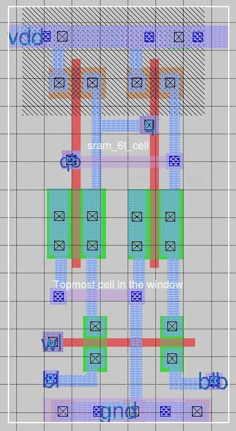
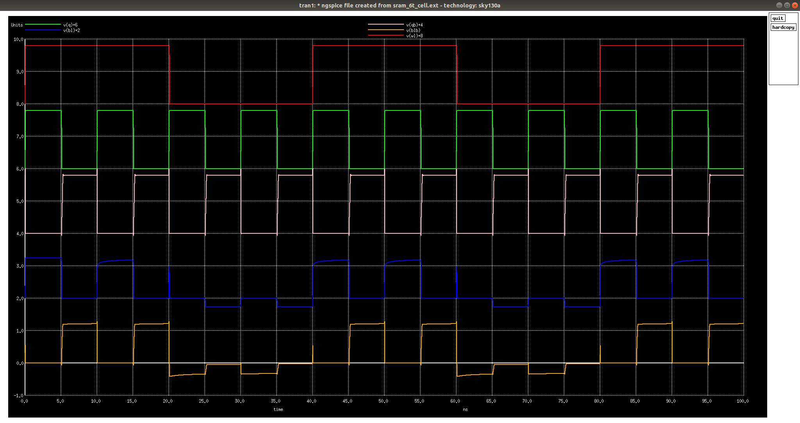
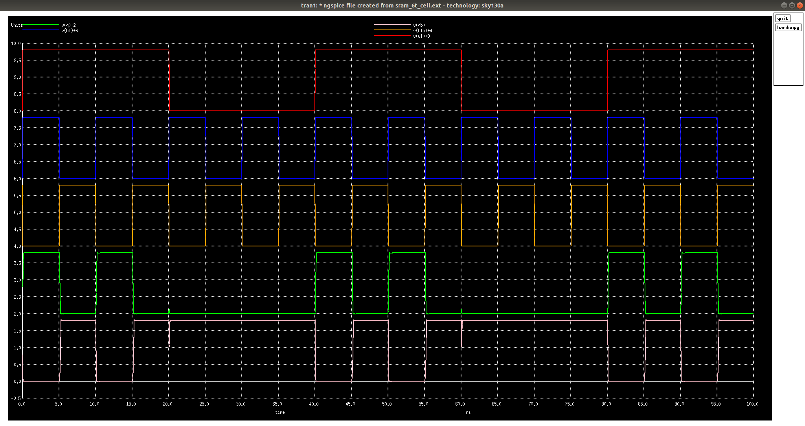
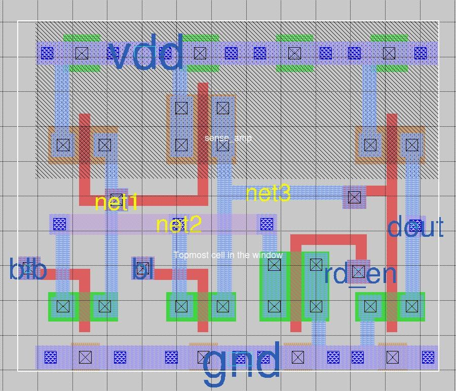
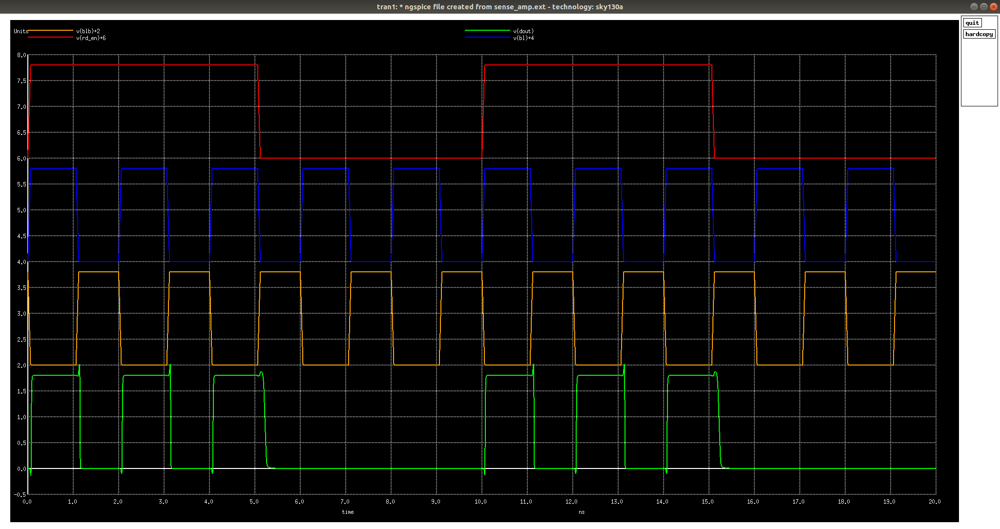
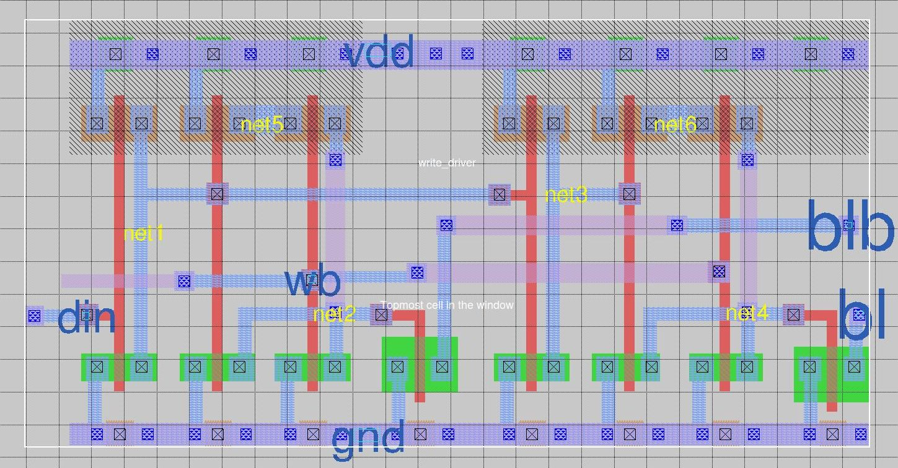
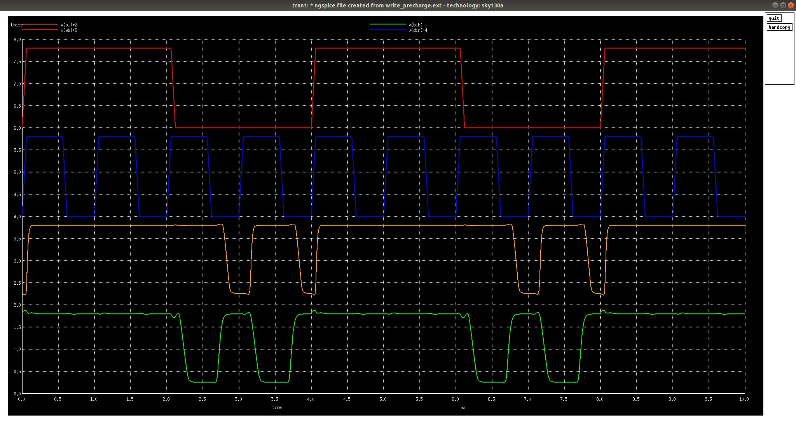
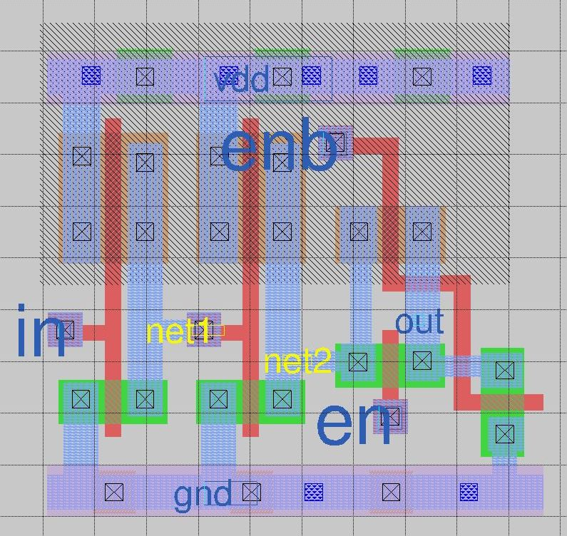
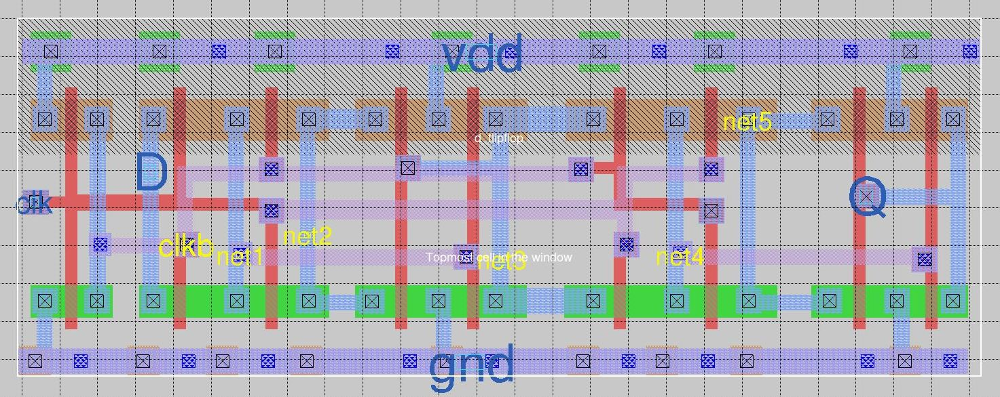
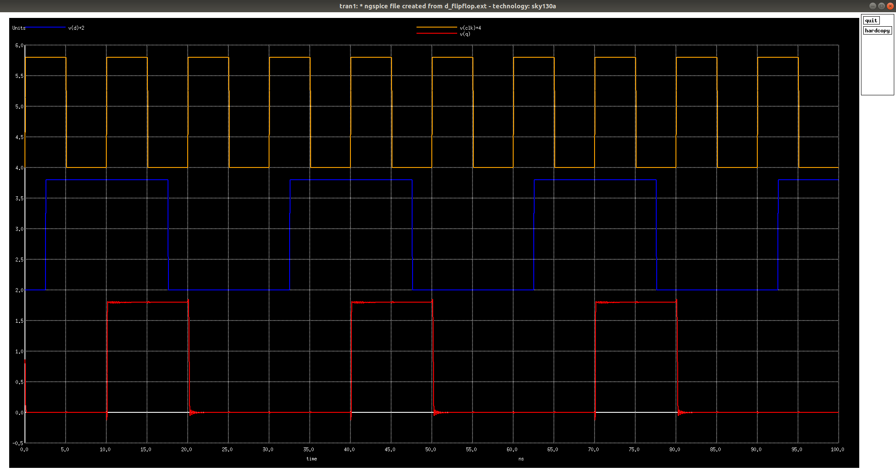

# Design of 1024x32 SRAM (32Kbits) using OpenRAM and SKY130 PDKs 
  This repository aims at design of 1024x32 SRAM cell array (32Kbits or 4KB) with a configuration of 1.8 V operating voltage and access time less than 2.5ns using Google SkyWater SKY130 PDKs and OpenRAM memory complier.
  
  Static Random-Access Memory (SRAM) has become a standard element of any Application Specific Integrated Circuit (ASIC), System-On-Chip (SoC), or other micro-architectures. For this wide variety of applications, SRAMs are configured using parameters like the word-length, bit lines, operating voltage, access time, and most importantly the technology node. The access time of an SRAM cell is the time require for a read or write operation of SRAM. 
  
  Manually configuring the SRAM for every change in parameter seems a slightly in-efficient and tedious task. Due to this reason, the memory compiler is used on a large scale, as it facilitates easy configuration and optimization of memory. OpenRAM, an open-source memory compiler is used for characterization and generation of SRAM designs.
  
# Table of Contents
  - [Specifications](#specifications)
  - [Setting Up Environment](#setting-up-environment)
  - [OpenRAM Configuration For SkyWater SKY130 PDKs](#openram-configuration-for-skywater-sky130-pdks)
    - [OpenRAM Directory Structure](#openram-directory-structure)
    - [Porting SKY130 to OpenRAM](#porting-sky130-to-openram)
    - [Sample OpenRAM Configurations](#sample-openram-configurations)
    - [Usage of OpenRAM](#usage-of-openram)
  - [OpenRAM Compiler Output Layout](#openram-compiler-output-layout)
  - [Custom Cells for OpenRAM](#custom-cells-for-openram)
      1. [6T SRAM Cell](#1-6t-sram-cell)
      2. [Pre-charge Circuit](#2-pre-charge-circuit)
      3. [Sense Amplifier](#3-sense-amplifier)
      4. [Write Driver](#4-write-driver)
      5. [Tri-State Buffer](#5-tri-state-buffer)
      6. [D-Flip-Flop](#6-d-flip-flop)
  - [References](#references)
  - [Acknowledgement](#acknowledgement)
  - [Contact Information](#contact-information)
  
# Specifications
  The specifications of a 32Kbits (32 x 1024) SRAM generated using OpenRAM compiler and SKY130 PDKs are mentioned below:
  
### Ports and Configuration 
<table id= "data">
<thead>
	<tr><th>Type</th><th>Value</th></tr>
</thead>
<tbody>
	<tr><tr><td>WORD_SIZE</td><td>32</td></tr>
	<tr><td>NUM_WORDS</td><td>1024</td></tr>
	<tr><td>NUM_BANKS</td><td>1</td></tr>
	<tr><td>NUM_RW_PORTS</td><td>1</td></tr>
	<tr><td>NUM_R_PORTS</td><td>0</td></tr>
	<tr><td>NUM_W_PORTS</td><td>0</td></tr>
	<tr><td>Area (&microm<sup>2</sup>)</td><td>534277</td></tr></tr>
</tbody>
</table>

### Operating Conditions

<table id= "data">
<thead>
	<tr><th>Parameter</th><th>Min</th><th>Typ</th><th>Max</th><th>Units</th></tr>
</thead>
<tbody>
	<tr><tr><td>Power supply (VDD) range</td><td>1.8</td><td>1.8</td><td>1.8</td><td>Volts</td></tr>
	<tr><td>Operating Temperature</td><td>0</td><td>25</td><td>100</td><td>Celsius</td></tr>
	<tr><td>Operating Frequency (F)</td><td></td><td></td><td>86</td><td>MHz</td></tr></tr>
</tbody>
</table>

### Timing Data (Using analytical model: results may not be precise)
<table id= "data">
<thead>
	<tr><th>Parameter</th><th>Min</th><th>Max</th><th>Units</th></tr>
</thead>
<tbody><tr><tr><td>din0[31:0] setup rising</td><td>0.009</td><td>0.009</td><td>ns</td></tr><tr><td>din0[31:0] setup falling</td><td>0.009</td><td>0.009</td><td>ns</td></tr><tr><td>din0[31:0] hold rising</td><td>0.001</td><td>0.001</td><td>ns</td></tr><tr><td>din0[31:0] hold falling</td><td>0.001</td><td>0.001</td><td>ns</td></tr><tr><td>dout0[31:0] cell rise</td><td>-1.968</td><td>3.437</td><td>ns</td></tr><tr><td>dout0[31:0] cell fall</td><td>2.922</td><td>3.125</td><td>ns</td></tr><tr><td>dout0[31:0] rise transition</td><td>0.007</td><td>0.027</td><td>ns</td></tr><tr><td>dout0[31:0] fall transition</td><td>0.007</td><td>0.027</td><td>ns</td></tr><tr><td>csb0 setup rising</td><td>0.009</td><td>0.009</td><td>ns</td></tr><tr><td>csb0 setup falling</td><td>0.009</td><td>0.009</td><td>ns</td></tr><tr><td>csb0 hold rising</td><td>0.001</td><td>0.001</td><td>ns</td></tr><tr><td>csb0 hold falling</td><td>0.001</td><td>0.001</td><td>ns</td></tr><tr><td>addr0[9:0] setup rising</td><td>0.009</td><td>0.009</td><td>ns</td></tr><tr><td>addr0[9:0] setup falling</td><td>0.009</td><td>0.009</td><td>ns</td></tr><tr><td>addr0[9:0] hold rising</td><td>0.001</td><td>0.001</td><td>ns</td></tr><tr><td>addr0[9:0] hold falling</td><td>0.001</td><td>0.001</td><td>ns</td></tr><tr><td>web0 setup rising</td><td>0.009</td><td>0.009</td><td>ns</td></tr><tr><td>web0 setup falling</td><td>0.009</td><td>0.009</td><td>ns</td></tr><tr><td>web0 hold rising</td><td>0.001</td><td>0.001</td><td>ns</td></tr><tr><td>web0 hold falling</td><td>0.001</td><td>0.001</td><td>ns</td></tr></tr></tbody>
</table>

### Power Data
<table id= "data">
<thead>
	<tr><th>Pins</th><th>Mode</th><th>Power</th><th>Units</th></tr>
</thead>
<tbody>
<tr><tr><td>!csb0 & clk0 & !web0</td><td>Read Rising</td><td>5.8939</td><td>mW</td></tr><tr><td>!csb0 & clk0 & !web0</td><td>Read Falling</td><td>5.8939</td><td>mW</td></tr><tr><td>!csb0 & !clk0 & web0</td><td>Write Rising</td><td>5.8939</td><td>mW</td></tr><tr><td>!csb0 & !clk0 & web0</td><td>Write Falling</td><td>5.8939</td><td>mW</td></tr><tr><td>csb0</td><td>leakage</td><td>0.033462</td><td>mW</td></tr></tr>
</tbody>
</table>

# Setting Up Environment
  This repository mentioned multiple open-source circuit schematic design, layout design, SPICE simulations tools and memory compiler. The tools used and their installation is explained in details below. All the SkyWater SKY130 PDKs related files are added to the repository, which can be used without installing the complete PDKs. In order to install or get other details of SkyWater PDKs, it can be found [here](https://github.com/google/skywater-pdk).
  
### Python Dependencies
  * Python 3.5 or higher 
  * Python numpy (`pip3 install numpy`)
  * Python scipy (`pip3 install scipy`)
  
### SPICE Simulator
  * Ngspice 

### Layout Tool
  * Magic

### Clone OpenRAM Repository
```
    git clone https://github.com/VLSIDA/OpenRAM.git
```

### Configure Environment Variables
```
    export OPENRAM_HOME="$(pwd)/compiler"
    export OPENRAM_TECH="$(pwd)/technology"
```

# OpenRAM Configuration For SkyWater SKY130 PDKs
The detailed OpenRAM configuration, usage and issues for SKY130 pdk is documented in this section.

## OpenRAM Directory Structure
  After the installation is properly done. The directory structure of OpenRAM directory looks similar to that of mentioned. 
  ```
    ├── OpenRAM 
    |  ├── compiler
    |  ├── technologies
    |     ├── freepdk45  (available with compiler)
    |     ├── scn4m_subm (available with compiler)
    |     ├── sky130A 

  ```
  The `sky130A` directory is not available by default. You need to create it in order to add support for SkyWater PDK Sky130. The detailed contents and their description is explained further in the document. Also, the configure `sky130A` directory is included in the repository for reference. It can be found at [OpenRAM/sky130A/](https://github.com/ShonTaware/SRAM_SKY130/tree/main/OpenRAM/sky130A)

## Porting SKY130 to OpenRAM
The OpenRAM compiler is currently available for two technologies, namely - SCMOS and FreePDK45.
For adding a new technology support to OpenRAM, a directory with name of process node should be created in `technology` directory of OpenRAM.

The `technology` directory should contains following information.

  ```
    ├── technology 
    |  ├── sky130A
    |     ├── gds_lib
    |     ├── sp_lib
    |     ├── mag_lib (optional)
    |     ├── models
    |     ├── layers.map (can be included in another sub-directory)
    |     ├── tech
    |        ├── __init__.py
    |        ├── tech.py
    |        ├── sky130A.tech

  ```

### `gds_lib` directory
  This directory contains all the custom premade library cells in `.gds` file format. Following files should be listed in the gds_lib directory:
  1. dff.gds
  2. sense_amp.gds
  3. write_driver.gds
  4. cell_6t.gds
  5. replica_cell_6t.gds
  6. dummy_cell_6t.gds 

### `sp_lib` directory
This directory contains all the spice netlsits of custom premade library cells in `.sp` file format. 

### `models` directory
This directory contains all the NMOS and PMOS models for temperatures, voltages and process corners as per requirement. This repository contains the nfet and pfet models for all process corners operating at 1.8 V. 

### `layers.map`
This file contains the layer description for gds layers. It needs to be generated from the SKY130 PDK document provided by SkyWater. You can find the document [here](https://docs.google.com/spreadsheets/d/1oL6ldkQdLu-4FEQE0lX6BcgbqzYfNnd1XA8vERe0vpE/edit#gid=0).
  
The `layers.map` should be organized in a specific syntax. Here, each layer is given on a separate line in below mentioned format:

  ```
    <layer-name> <purpose-of-layer> <GDS-layer> <GDS-purpose>
  ```
The `layers.map` file is added to the repository and can be found [here](https://github.com/ShonTaware/SRAM_SKY130/blob/main/OpenRAM/sky130A/layers.map).  

### `tech/` Directory
  This directory should contains two mandatory file listed below. Any other optional scripts can also be included if required.

  * `tech/sky130A.tech`
  * `tech/tech.py`

### `tech/sky130A.tech`
  This is the technology file provided by SkyWater in the SKY130 PDKs. It needs to copied to this `tech` directory.
  The `sky130A.tech` technology file is added to the repository.

### `tech/tech.py`
  This python file contains all the technology related configuration. It contains information about below mentioned paramaters.
  
1. Custom modules
2. Custom cell properties
3. Layer properties
4. GDS file information
5. Interconnect stacks : This defines the contacts and preferred directions of the metal, poly and active diffusion layers.
6. Power grid
7. GDS Layer Map
8. Layer names for external PDKs
9. DRC/LVS Rules Setup
10. Technology parameter
11. Spice Simulation Parameters
12. Logical Effort relative values for the Handmade cells
13. Technology Tool Preferences

## Sample OpenRAM Configurations
  The sample OpenRAM configurations are added to the repository. To use it, copy the `sky130A` directory into the `technology` directory of OpenRAM.

```
  cp -rf OpenRAM/sky130A $OPENRAM_TECH/
```
  * [Sample 2](https://github.com/ShonTaware/SRAM_SKY130/tree/main/OpenRAM/Sample2/sky130A): It modified technology files, mag_lib, sp_lib, gds_lib, tech.py and layers.map files.

## Usage of OpenRAM
  A configuration file need to be generated in python which contains all parameters required for the compiler. Every parameter mentioned in the configuration file overrides the default value of the parameter. If a parameter is not mentioned in the file, compiler will take a default value.
  
A template file named `myconfig_sky130.py` is added in the repository. The file contains parameters as given below.

```
  # Data word size
  word_size = 32
  
  # Number of words in the memory
  num_words = 1024

  # Technology to use in $OPENRAM_TECH
  tech_name = "sky130A"
  
  # You can use the technology nominal corner only
  #nominal_corner_only = True
  # Or you can specify particular corners
  # Process corners to characterize
  process_corners = ["TT"]
  
  # Voltage corners to characterize
  supply_voltages = [ 1.8 ]
  
  # Temperature corners to characterize
  # temperatures = [ 0, 25 100]

  # Output directory for the results
  output_path = "temp"
  
  # Output file base name
  output_name = "sram_{0}_{1}_{2}".format(word_size,num_words,tech_name)

  # Disable analytical models for full characterization (WARNING: slow!)
  # analytical_delay = False
```

  OpenRAM is invoked using the following command
```
  python3 $OPENRAM_HOME/openram.py myconfig_sky130
  
  or
  
  python3 $OPENRAM_HOME/openram.py myconfig_sky130.py
```

  

# OpenRAM Compiler Output Layout
  The Layout for 2 X 16 SRAM cell is show below. The detailed report can be found [here](https://htmlpreview.github.io/?https://github.com/ShonTaware/SRAM_SKY130/blob/main/OpenRAM/results/SRAM_2x16/sram_2_16_sky130A.html)
  

  The Layout for 32 X 1024 SRAM cell is show below. The detailed report can be found [here](https://htmlpreview.github.io/?https://github.com/ShonTaware/SRAM_SKY130/blob/main/OpenRAM/results/SRAM_32x1024/sram_32_1024_sky130A.html)
  

# Custom Cells for OpenRAM

## Pre-Layout Schematic and Simulations

### 1. 6T SRAM Cell
  As the name says, 6T SRAM cell consists of 6 MOSFETS - 2 PMOS and 4 NMOS. It is design by cross coupling two CMOS inverters which hold the bit, and two access transistor for enabling the access to the cross coupled inverters.

  

### Schematic
  The figure below shows the schematic of the generic 6T SRAM cell. Here, M1, M2 make the first inverter; M3, M4 make the second inverter and M5, M6 are the access transistors.

  

### Read Operation
  The read operation is a critical one in SRAM cell. This is becuase, before enabling the access transistors, the bit-lines are first pre-charged to high logic. Depending upon the bit store, one of the bit-line is pulled back to logic low when the access transistors are enabled. 

	$    ngspice Prelayout/Spice_models/SRAM_6T_Cell_read.spice

  

### Write Operation
  The bit to be written is first loaded to the bit-line and its inverted bit is loaded on the other bit-line. Once the access transistors are enabled the bit values on bit-lines are over-written on the inverter logic.

	$    ngspice Prelayout/Spice_models/SRAM_6T_Cell_write.spice

  

### Analyzing Stability of 6T SRAM Cell

* **Static Noise Margin**

  Static noise margin (SNM) is a key figure of merit for an SRAM cell. It can be extracted by nesting the largest possible square in the two voltage transfer curves (VTC) of the two CMOS inverters involved. The SNM is defined as the side-length of the square (i.e. diagonal-length), given in volts. When an external DC noise is larger than the SNM, the state of the SRAM cell can change and data is lost.

1. **Hold SNM**

  

        $    ngspice Prelayout/Spice_models/SRAM_Cell_hold_snm.spice

  
  SNM<sub>high</sub> = 1.0879 V <br />
  SNM<sub>low</sub> = 1.1112 V <br />
  Hold SNM = min(SNM<sub>high</sub>, SNM<sub>low</sub>) = 1.0879 V  <br /><br />

2. **Read SNM**

  

        $    ngspice Prelayout/Spice_models/SRAM_Cell_read_snm.spice

  
  SNM<sub>high</sub> = 0.5511 V <br />
  SNM<sub>low</sub> = 0.4294 V <br />
  Read SNM = min(SNM<sub>high</sub>, SNM<sub>low</sub>) =  0.4294 V <br /><br />

3. **Write SNM**

  

        $    ngspice Prelayout/Spice_models/SRAM_Cell_write_snm.spice

  
  Write SNM = 1.3494 V  <br /><br />

* **N-Curve**
  N-curve is a metric used for inline testers. It gives information for both voltage and current, and in addition it has no voltage scaling delimiter as found in SNM approach. It also has the complete information about the SRAM stability and also write ability in a single plot. N-curve can be further extended to power metrics in which both the voltage and current information are taken into consideration to provide better stability analysis of the SRAM cell.

  

        $    ngspice Prelayout/Spice_models/SRAM_Cell_n_curve.spice

  

  1. **Static Voltage Noise Margin (SVNM):** It is the voltage difference between point A and B. It indicates the maximum tolerable DC noise voltage of the cell before its content changes.
  <br /> SVNM = 0.5644 V

  2. **Static Current Noise Margin (SINM):** It is the additional current information provided by the N-curve, namely the peak current located between point A and B. It can also be used to characterize the cell read stability.
  <br /> SINM = 122.6 uA

  **Note:** For better read stability, SVNM and SINM must be high value.

  3. **Write-Trip Voltage (WTV):** It is the voltage difference between point C and B. It is the voltage drop needed to flip the internal node “1” of the cell with both the bit-lines clamped to VDD.
  <br /> WTV = 0.9422 V
  
  4. **Write-Trip Current (WTI):** It is the negative current peak between point C and B. It is the amount of current needed to write the cell when both bit-lines are kept at VDD.
  <br /> WTI = -30.869 uA

### 2. Pre-charge Circuit
  This circuit block is used to pre-charge the bit-lines to Vdd or high logic during a read operation.

  Shown below is the schematic and simulation of the Pre-charge circuit.

  

	$    ngspice Prelayout/Spice_models/precharge_circuit.spice

  

### 3. Sense Amplifier
  Sense Amplifiers in SRAM generally a Differential Voltage Amplifier. They form a very important part of SRAM memory as these amplifiers define the robustness of the bit-lines sensing. The function of sense amplifier is to amplify the very small analog differential voltage between the bit-lines during a read operation and provide a digital output. This effectively reduces the time required for the read operation, as each individual cell need not fully discharge the bit line.
  * if bit > bit_bar, output is 1
  * if bit < bit_bar, output is 0

  Shown below is the schematic and simulation of a Sense Amplifier.

  

        $    ngspice Prelayout/Spice_models/sense_amplifier.spice

  

### 4. Write Driver
  As discussed in read operation, the bit-lines are pre-charged to Vdd during the read operation. If a write operation occurs, one of the bit-lines should driven back to low logic before enabling access transistors. Write drivers are used for this purpose.

  Shown below is the schematic and simulation of a Write Driver.

  

      	$    ngspice Prelayout/Spice_models/write_driver.spice

  

### 5. Tri-State Buffer
  Tri-state buffer is a normal buffer with an extra enable input. Whenever, the enable input is high, tri-state buffer behaves as a normal buffer, otherwise it will either give high impedance or low logic as output.

  Shown below is the schematic and simulation of a Tri-State Buffer.

  

      	$    ngspice Prelayout/Spice_models/tristate_buffer.spice

  

### 6. D-Flip-Flop
  Shown below is the schematic and simulation of a Positive Edge triggered D-Flip-Flop.

  

      	$    ngspice Prelayout/Spice_models/d_ff.spice

  

### 1-bit SRAM
  1-bit SRAM comprises of a 6T SRAM cell, a sense amplifier, a write driver and a pre-charge circuit.

  

  * Read Operation

        $    ngspice Prelayout/Spice_models/SRAM_1bit_read.spice

  

  * Write Operation

        $    ngspice Prelayout/Spice_models/SRAM_1bit_write.spice

  

## Layouts and Postlayout Simulations

 Layouts are created for all custom cells in Magic EDA with sky130A.tech (Technology file), layouts are checked for DRC violations and RC extracted to a postlayout spice netlist. Extracted postlayout spice netlist is backannotated, simlulated to verify and match the response with prelayout simulations.
 To perform simulations, enter the following command to change present working directory to "postlayout". Follow later mentioned commands to simulate each netlist.

### 1. 6T SRAM Cell


Layout Area: 29.70 um^2 

**-> Read Operation**


**-> Write Operation**


### 2. Sense Amplifier


Layout Area: 30.54 um^2 



### 3. Write Driver


Layout Area: 84.89 um^2 



### 4. Tristate Buffer


Layout Area: 23.18 um^2 


### 5. Positive Edge Triggered DFF


Layout Area: 60.25 um^2 



# References
  - VLSI System Design: https://www.vlsisystemdesign.com/
  - Efabless OpenLANE: https://github.com/efabless/openlane
  - OpenRAM: https://vlsida.github.io/OpenRAM/
  - M. Guthaus et al., “OpenRAM: An open-source memory compiler,” *2016 IEEE/ACM International Conference on Computer-Aided Design(ICCAD)*, Austin, TX, 2016, pp. 1-6.
  - Nickson Jose: [Standard cell design and characterization using openlane flow](https://github.com/nickson-jose/vsdstdcelldesign)

# Acknowledgement
  - [Kunal Ghosh](https://github.com/kunalg123), Co-founder, VSD Corp. Pvt. Ltd.
  - Matthew R. Guthaus, University of California, Santa Cruz.
  - [Pradeepkumar S K](https://github.com/pradeepsk13), Assistant Professor, Electronics and Communication Engineering, Kalpataru Institute of Technology, Tiptur, Karnataka.
  
# Contact Information
  - [Shon Taware](https://www.linkedin.com/in/Shon-Taware/), M.Tech. Embedded Systems and VLSI Design
  - [Kunal Ghosh](https://github.com/kunalg123), Co-founder, VSD Corp. Pvt. Ltd.
